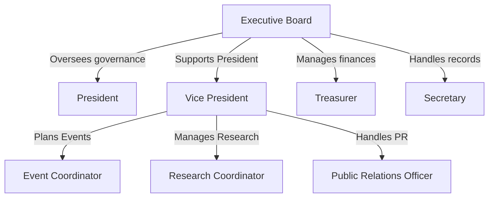

# The Cognitive Neuroscience Research Organization

## _The UWP Cognitive Neuroscience Club (CNC)_



## _Welcome_!&#x20;

_This is the GitHub-based documentation and public access resources of the CNC._



### _Check Out the Source Code on GitHub!_




###




***

