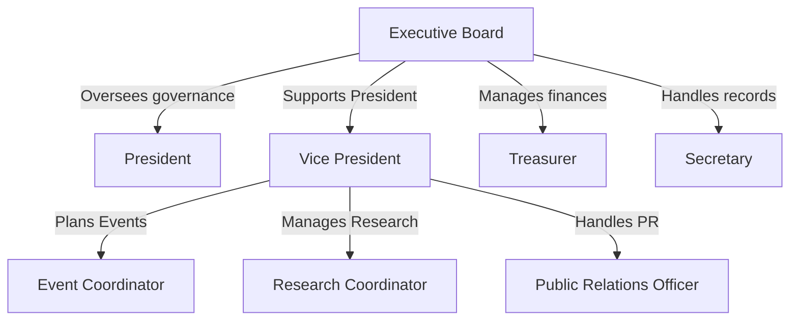

# Organizational Framework

***

## Positions & Responsibilities:

1. **`President`**
   1. Oversees all club activities & meetings.
   2. Acts as the official representative.
   3. Ensures compliance with SUFAC & University policies.
2. **`Vice President`**
   1. Assists the President
   2. Leads event planning & initiatives.
   3. Oversees committee activities.
3. **`Treasurer`**
   1. Manages club finances, fundraising & budgeting.
   2. Submits financial reports to the Executive Board & SUFAC.
4. **`Secretary`**
   1. Maintains meeting minutes, attendance records & correspondence.
   2. Assists in managing club websites & social media—aided by the assistance of the media manager.

\
