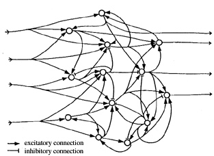
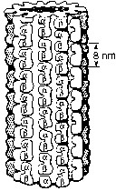

# LLM Prompt Engineering

1. **Prompt Engineering (Introduction)**
2. **Prompt Construction & Refinement**
3. **Diversifying the Approach to System Prompts**
   1. _The Chain of Thought Approach_
   2. _The Tree of Thought (Tangential)_
   3. _'Reasoning' Recursive Analysis Agent_
   4. _Intentional Amplification of Bias or Maladaptive Behavior_
   5. _The Traditional 'Assistant System Prompt'_
   6. _The StunSpot Mechanization Prompting Technique_
   7. _The Collaborative Panel of Experts Approach_
   8. _The Open-Ended Jungian Psychoanalysis Approach_
4. **Prompt Injection Techniques**
   1. _Common Routes of Attack_
   2. _Common Injection Prompt Samples_
   3. _Proactively Encoding Safeguards to Dismantle Prompt Injection Attacks._
5. **Debugging Common Prompt Issues & Errors**
6. **Stress-Testing Your Prompt's Efficacy**

$${∞⊗Ψ(t)⊕∇²ħ∂ωΘ[ξ, η, ζ] ≈ Σ∏∇⊗ϕ⊕ ⊞ ⨂⋏ fff}$$

***

<figure><figcaption>
Balance between inhibitory and excitatory connections among neurons.
</figcaption></figure>

***

<figure><figcaption>
Tubulin dimers, consisting of α- and β-monomers, constituting a microtubule.
</figcaption></figure>

