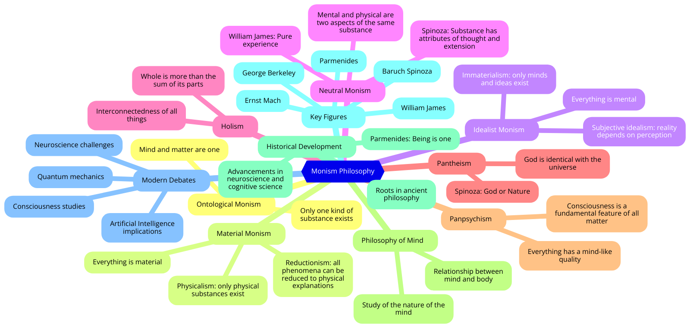

# Monism

<figure><figcaption></figcaption></figure>

***

## The Mind-Body Problem

The mind-body problem concerns the relationship between the mental (consciousness, experiences, thoughts) and the physical (brain, body, physical processes). This problem is central to the philosophy of mind and has led to various theories, including dualism, which posits two distinct substances (mind and body), and monism, which posits a single substance or principle.

**Forms of Monism and Their Application to Consciousness**

1. **Physicalism (Material Monism):**
   * **Definition:** Physicalism is the view that everything, including mental states and consciousness, can be explained in terms of physical processes and properties.
   * **Application to Consciousness:** Physicalists argue that consciousness arises from and is reducible to brain activity. Neural correlates of consciousness (NCCs) are studied to understand how specific brain processes correspond to conscious experiences.
   * **Implications:** Physicalism aims to provide a scientifically grounded explanation of consciousness, asserting that mental states are brain states. This approach faces challenges in addressing the "hard problem of consciousness" (explained below).
   * **Challenges:** Critics argue that physicalism struggles to explain subjective experiences or qualia—the qualitative aspects of conscious experience. David Chalmers famously articulated this as the "hard problem of consciousness," which questions how and why physical processes give rise to subjective experience.
2. **Idealism (Mental Monism):**
   * **Definition:** Idealism posits that reality is fundamentally mental or consists of ideas. According to idealism, the physical world is either dependent on the mind or reducible to mental phenomena.
   * **Application to Consciousness:** Idealists argue that consciousness is primary and that the physical world is an extension or construct of the mind. Consciousness is the fundamental substance, and physical entities are manifestations of mental processes.
   * **Implications:** Idealism emphasizes the primacy of consciousness and offers an alternative to physicalist explanations. It suggests that understanding consciousness involves understanding the mental nature of reality itself.
   * **Challenges:** Idealism faces difficulties in explaining the apparent objectivity and independence of the physical world. Critics also question how idealism can account for intersubjective agreement about the physical world.
3. **Neutral Monism:**
   * **Definition:** Neutral monism holds that the fundamental substance of reality is neither purely mental nor purely physical but a neutral substance that underlies both.
   * **Application to Consciousness:** Neutral monists propose that both mental and physical properties emerge from a neutral substance. Consciousness and physical phenomena are seen as different aspects of the same underlying reality.
   * **Implications:** This approach offers a unified framework for understanding consciousness and physical phenomena, avoiding the reductionism of physicalism and the primacy of idealism.
   * **Challenges:** Neutral monism must explain the nature of the neutral substance and how it gives rise to both mental and physical properties. It also faces the challenge of integrating this view with empirical scientific findings.
4. **Panpsychism:**
   * **Definition:** Panpsychism posits that consciousness is a fundamental and ubiquitous feature of the universe. All entities, from atoms to humans, possess some form of consciousness or proto-consciousness.
   * **Application to Consciousness:** Panpsychists argue that consciousness is not exclusive to complex organisms but is a basic property of all matter. Human consciousness is seen as a higher-level organization of more fundamental conscious entities.
   * **Implications:** Panpsychism provides a potential solution to the hard problem of consciousness by suggesting that consciousness is an intrinsic feature of the universe. It avoids the problem of emergence by positing that consciousness is already present at the fundamental level.
   * **Challenges:** Panpsychism faces the "combination problem," which questions how simple forms of consciousness combine to form the complex consciousness experienced by humans. It also requires a rethinking of the relationship between consciousness and physical processes.

**Monism vs. Dualism**

* **Dualism:** Dualism posits two distinct substances—mind and body—each with its own properties and laws. This view faces challenges in explaining the interaction between the two substances and the apparent unity of conscious experience.
* **Monism:** Monism, in its various forms, seeks to explain consciousness as part of a single, unified reality. Monistic approaches aim to provide a more integrated understanding of the relationship between the mental and the physical.

**Addressing the Hard Problem of Consciousness**

The hard problem of consciousness, as articulated by David Chalmers, questions how and why physical processes in the brain give rise to subjective experiences. Monistic approaches offer different strategies for addressing this problem:

1. **Physicalism:** Seeks to explain consciousness through the detailed study of brain processes and neural correlates, though it struggles with the subjective nature of experience.
2. **Idealism:** Posits that consciousness is fundamental and seeks to explain physical phenomena as manifestations of the mind.
3. **Neutral Monism:** Proposes a unified substance that underlies both mental and physical properties, offering a potential bridge between the two.
4. **Panpsychism:** Suggests that consciousness is a basic feature of the universe, providing a foundation for the emergence of complex conscious experiences.

**Conclusion**

Monism offers a variety of approaches for understanding the nature of consciousness, each with its own strengths and challenges. Whether through physicalism's focus on brain processes, idealism's emphasis on the primacy of mind, neutral monism's unified substance, or panpsychism's ubiquitous consciousness, monistic theories aim to provide a coherent framework for addressing the mind-body problem and the hard problem of consciousness. These approaches continue to influence contemporary debates and research in the philosophy of mind and cognitive science.

#### See Also

* 🧠 [David Chalmers on the Hard Problem of Consciousness](https://www.google.com/search?q=David+Chalmers+hard+problem+of+consciousness)
* 🧩 [Panpsychism and Consciousness](https://www.google.com/search?q=Panpsychism+and+consciousness)
* ⚛️ [Neutral Monism in Philosophy](https://www.google.com/search?q=Neutral+Monism+philosophy)

#### You May Also Enjoy

* 📚 [Exploring Idealism](https://www.google.com/search?q=Exploring+Idealism): Delve into the philosophical tradition that emphasizes the primacy of mind.
* 🧩 [Mind-Body Problem in Contemporary Philosophy](https://www.google.com/search?q=Mind-Body+Problem+contemporary+philosophy): Discover how modern philosophers address the relationship between mind and body.

