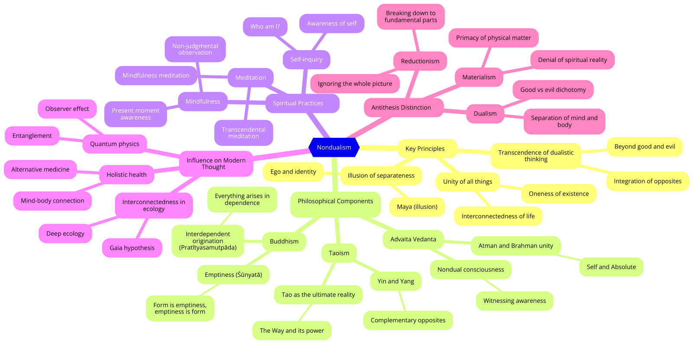

# Non-Dualism

<figure><figcaption>
<em>Non-Dualism Mindmap.</em>
</figcaption></figure>

## Core Methodology

**Nondualism** involves the recognition and realization that the apparent dualities of existence (such as self/other, subject/object, and mind/matter) are ultimately expressions of a single, unified reality. Its methodology includes:

1. **Direct Experience**: Emphasizing personal, experiential realization over intellectual understanding.
2. **Meditative Practices**: Utilizing meditation and mindfulness to transcend dualistic perceptions.
3. **Inquiry and Reflection**: Engaging in self-inquiry and philosophical reflection to dissolve the distinctions between self and other.
4. **Integration**: Incorporating nondual awareness into everyday life and activities.

### Framework

Nondualism operates within a framework that encompasses:

1. **Philosophical Monism**: The view that there is only one ultimate reality or substance.
2. **Perennial Philosophy**: Recognizing common nondual insights across various spiritual and philosophical traditions.
3. **Transcendence of Dualities**: Going beyond the binary distinctions that characterize ordinary perception and thought.
4. **Unity of Being**: Affirming the inherent interconnectedness and oneness of all existence.

### Core Concepts

1. **Advaita**: A Sanskrit term meaning "not two," central to many nondual traditions, particularly in Hindu philosophy.
2. **Shunyata (Emptiness)**: A concept in Buddhism that denotes the absence of inherent, independent existence.
3. **Interconnectedness**: The idea that all things are fundamentally interconnected and interdependent.
4. **Non-Self (Anatta)**: In Buddhism, the doctrine that there is no permanent, independent self.

### Critical Texts

1. **"The Upanishads"**: Ancient Indian texts that explore the nature of reality and the self, foundational to Advaita Vedanta.
2. **"The Heart Sutra"**: A key Mahayana Buddhist text that articulates the concept of emptiness (shunyata).
3. **"Ashtavakra Gita"**: An ancient Indian scripture that offers a concise and profound exposition of Advaita Vedanta.

### Influential Texts

1. **"I Am That" by Nisargadatta Maharaj**: A collection of dialogues with a modern Indian sage, exploring nondual awareness.
2. **"Be As You Are: The Teachings of Sri Ramana Maharshi"**: A compilation of teachings from the renowned Indian saint on self-inquiry and nondual realization.
3. **"The Book: On the Taboo Against Knowing Who You Are" by Alan Watts**: A modern interpretation of nondual principles, blending Eastern and Western thought.

### Exemplary Cases

1. **Ramana Maharshi**: An influential Indian sage whose teachings on self-inquiry (Atma Vichara) have profoundly impacted nondual philosophy.
2. **Nisargadatta Maharaj**: A modern nondual teacher whose dialogues on the nature of the self have been widely studied.
3. **Dogen Zenji**: The founder of the Soto school of Zen Buddhism, who emphasized the nondual nature of reality through meditation practice (Zazen).

### **Direct Experience**

Nondualism prioritizes **direct experience** over theoretical knowledge. This means that the realization of nondual truth is not merely an intellectual exercise but a profound, lived experience. Practices like meditation, self-inquiry, and mindfulness help practitioners directly perceive the unity of existence, transcending the ordinary distinctions and dualities.

### **Meditative Practices**

**Meditative practices** are central to nondual traditions. Techniques such as Zen meditation (Zazen), Vipassana, and Advaita self-inquiry aim to quiet the mind and dissolve the sense of separateness. These practices foster a direct experience of nonduality, allowing practitioners to recognize the underlying unity of all things.

### **Inquiry and Reflection**

Nondual philosophy encourages **inquiry and reflection** to dissolve dualistic perceptions. In Advaita Vedanta, the practice of self-inquiry (Atma Vichara) involves persistently questioning the nature of the self, asking "Who am I?" until the illusory distinction between self and other is transcended. This process helps reveal the nondual nature of reality.

### **Integration**

A crucial aspect of nondualism is the **integration** of nondual awareness into everyday life. This means recognizing the unity of all things, not just in meditation but in all aspects of daily existence. It involves seeing beyond apparent differences and living from a place of unity, compassion, and interconnectedness.

**Advantages**:

* **Holistic Understanding**: Nondualism provides a holistic perspective that integrates all aspects of existence into a unified whole.
* **Spiritual Depth**: It offers profound spiritual insights and practices that lead to transformative experiences.
* **Cross-Cultural Resonance**: Nondual principles are found in many spiritual traditions, highlighting a universal aspect of human understanding.

**Criticisms**:

* **Perceived Mysticism**: Some critics view nondualism as overly mystical and lacking in empirical support.
* **Practical Challenges**: Integrating nondual awareness into daily life can be challenging and may seem impractical to some.
* **Complexity**: The abstract nature of nondual concepts can be difficult to grasp for those accustomed to dualistic thinking.

#### Conclusion

Nondualism is a profound and transformative philosophy that emphasizes the unity of all existence. Through direct experience, meditative practices, inquiry, and integration, nondualism reveals the interconnectedness and oneness of reality. Despite facing criticisms related to mysticism and practical application, nondualism provides a rich and universal framework for understanding the nature of existence and the self.
